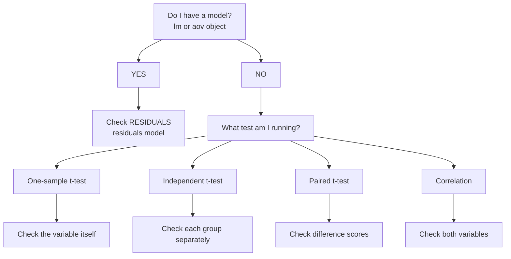

# Checking Normality: Workflow & R Code

!!! info "Practical Guide"
    This page provides step-by-step workflows for checking normality in R, organized by test type.

---

## 🎯 Decision Tree: What Should I Check?



---

## Quick Reference by Test Type

| Test Type | What to Check | How |
|-----------|---------------|-----|
| **One-sample t-test** | The variable | `shapiro.test(data$var)` |
| **Independent t-test** | Each group separately | `tapply(data$var, data$group, shapiro.test)` |
| **Paired t-test** | Difference scores | `shapiro.test(data$diff)` |
| **ANOVA** | Model residuals | `shapiro.test(residuals(model))` |
| **Regression** | Model residuals | `shapiro.test(residuals(model))` |
| **Correlation** | Both variables | `shapiro.test(data$x); shapiro.test(data$y)` |

---

## 📊 One-Sample t-test

### What to Check
The variable itself (comparing to a known value)

### R Code

```r
# Quick normality check
shapiro.test(data$variable)

# Visual inspection
hist(data$variable, 
     main = "Histogram", 
     col = "lightblue",
     xlab = "Values")

qqnorm(data$variable)
qqline(data$variable, col = "red")

# If normal: proceed with t-test
t.test(data$variable, mu = test_value)

# If NOT normal: use Wilcoxon
wilcox.test(data$variable, mu = test_value)
```

---

## 📊 Independent Samples t-test

### What to Check
Each group separately

### R Code

```r
# Check normality by group
library(dplyr)

# Visual by group
boxplot(outcome ~ group, data = data,
        main = "Distribution by Group",
        col = c("lightblue", "lightcoral"))

# Histogram by group
par(mfrow = c(1, 2))
hist(data$outcome[data$group == "Group1"], 
     main = "Group 1", col = "lightblue")
hist(data$outcome[data$group == "Group2"], 
     main = "Group 2", col = "lightcoral")
par(mfrow = c(1, 1))

# Statistical test by group
tapply(data$outcome, data$group, shapiro.test)

# If normal: proceed with t-test
t.test(outcome ~ group, data = data)

# If NOT normal: use Mann-Whitney U
wilcox.test(outcome ~ group, data = data)
```

---

## 📊 Paired t-test

### What to Check
The **difference scores** (not the raw measurements!)

### R Code

```r
# Create difference scores
data$diff <- data$after - data$before

# Check normality of differences
shapiro.test(data$diff)

# Visual inspection of differences
hist(data$diff, 
     main = "Distribution of Differences",
     col = "lightgreen",
     xlab = "After - Before")

qqnorm(data$diff)
qqline(data$diff, col = "red")

# If normal: proceed with paired t-test
t.test(data$after, data$before, paired = TRUE)

# If NOT normal: use Wilcoxon Signed-Rank
wilcox.test(data$after, data$before, paired = TRUE)
```

---

## 📊 ANOVA

### What to Check
**Model residuals** (NOT the raw data!)

### R Code

```r
# First, run your ANOVA model
model <- aov(outcome ~ group, data = data)

# THEN check residuals
shapiro.test(residuals(model))

# Visual inspection of residuals
hist(residuals(model), 
     main = "Residuals Distribution",
     col = "lightyellow",
     xlab = "Residuals")

qqnorm(residuals(model))
qqline(residuals(model), col = "red")

# Standard diagnostic plots
plot(model, which = 2)  # Q-Q plot

# If normal: interpret ANOVA results
summary(model)

# If NOT normal: use Kruskal-Wallis
kruskal.test(outcome ~ group, data = data)
```

---

## 📊 Regression

### What to Check
**Model residuals** (NOT X or Y individually!)

### R Code

```r
# First, run your regression model
model <- lm(outcome ~ predictor, data = data)

# THEN check residuals
shapiro.test(residuals(model))

# Comprehensive diagnostic plots
par(mfrow = c(2, 2))
plot(model)
par(mfrow = c(1, 1))

# Q-Q plot specifically
qqnorm(residuals(model))
qqline(residuals(model), col = "red")

# Histogram of residuals
hist(residuals(model), 
     main = "Residuals Distribution",
     col = "lightblue",
     xlab = "Residuals")

# If residuals normal: interpret results
summary(model)

# If NOT normal: consider transformation or robust methods
```

---

## 🔍 Interpreting Visual Methods

### Histogram

**Look for:**
- Bell-shaped curve = Good
- Skewed (long tail) = Concern
- Multiple peaks = Red flag

!!! success "Normal"
    Symmetric, single peak, bell-shaped

!!! warning "Non-Normal"
    Strongly skewed, flat, or multiple peaks

### Q-Q Plot (Quantile-Quantile)

**How to read:**
- Points fall on red line = Normal
- Points deviate systematically = Non-normal

**Common patterns:**

```
S-curve → Right-skewed
Backwards S → Left-skewed
Curve at ends → Heavy tails
Few outliers at ends → Usually okay
```

!!! tip "Pro Tip"
    A few points off the line at the extremes is usually fine. Look for systematic, large deviations.

### Boxplot

**Look for:**
- Symmetric box = Good
- Many outliers = Concern
- Extremely long whiskers = Concern

---

## 📈 Interpreting Shapiro-Wilk Test

### The Test

```r
shapiro.test(data$variable)
# or
shapiro.test(residuals(model))
```

### Interpreting Results

```
Shapiro-Wilk normality test

data:  data$variable
W = 0.96, p-value = 0.234
```

**Decision:**

| p-value | Interpretation | Action |
|---------|----------------|--------|
| p > .05 | Data are consistent with normality | ✓ Proceed with parametric test |
| p < .05 | Significant deviation from normality | ⚠ Consider alternatives |
| p < .01 | Strong evidence of non-normality | ⚠ Use non-parametric test |

!!! warning "Sample Size Matters"
    - Small samples (n < 30): Test has low power, may miss violations
    - Large samples (n > 100): Test may flag trivial violations
    
    **Always use visual methods + statistical test together!**

---

## 🎯 Complete Workflow Template

### For Model-Based Tests (ANOVA, Regression)

```r
# Step 1: Run your model
model <- aov(outcome ~ predictor, data = data)

# Step 2: Extract residuals
res <- residuals(model)

# Step 3: Visual check
par(mfrow = c(1, 2))
hist(res, main = "Residuals", col = "lightblue")
qqnorm(res); qqline(res, col = "red")
par(mfrow = c(1, 1))

# Step 4: Statistical test
shapiro.test(res)

# Step 5: Decision
# If p > .05 and visuals look good → Proceed
# If p < .05 or bad visuals → Consider alternatives
```

### For Simple Tests (t-tests)

```r
# Step 1: Identify what to check
# - One-sample: the variable
# - Independent: each group
# - Paired: difference scores

# Step 2: Visual check
hist(data$variable, col = "lightblue")
qqnorm(data$variable); qqline(data$variable, col = "red")

# Step 3: Statistical test
shapiro.test(data$variable)

# Step 4: Decision
# Normal → Parametric test
# Not normal → Non-parametric alternative
```

---

## ⚠️ Common Mistakes

!!! danger "Don't Do This"
    ❌ Checking raw data for ANOVA/regression (check residuals!)  
    ❌ Running analysis without checking assumptions  
    ❌ Ignoring visual methods (only using Shapiro-Wilk)  
    ❌ Panicking over minor violations with large samples  
    ❌ Using parametric tests with clearly non-normal small samples  

!!! success "Do This"
    ✓ Check residuals for model-based tests  
    ✓ Use visual + statistical methods together  
    ✓ Consider sample size in your decision  
    ✓ Know your non-parametric alternatives  
    ✓ Document your assumption checks  

---

## 📚 Next Steps

**Assumptions failing?** → [When Assumptions Fail](when-assumptions-fail.md)

**Want interactive practice?** → [Normality Modules](../modules/overview.md#1-checking-normality-series-5-modules)

**Need conceptual review?** → [Understanding Normality](understanding-normality.md)

**Other assumptions?** → [Other Assumptions](other-assumptions.md)

---

[← Understanding Normality](understanding-normality.md) | [Home](../index.md) | [When Assumptions Fail →](when-assumptions-fail.md)
