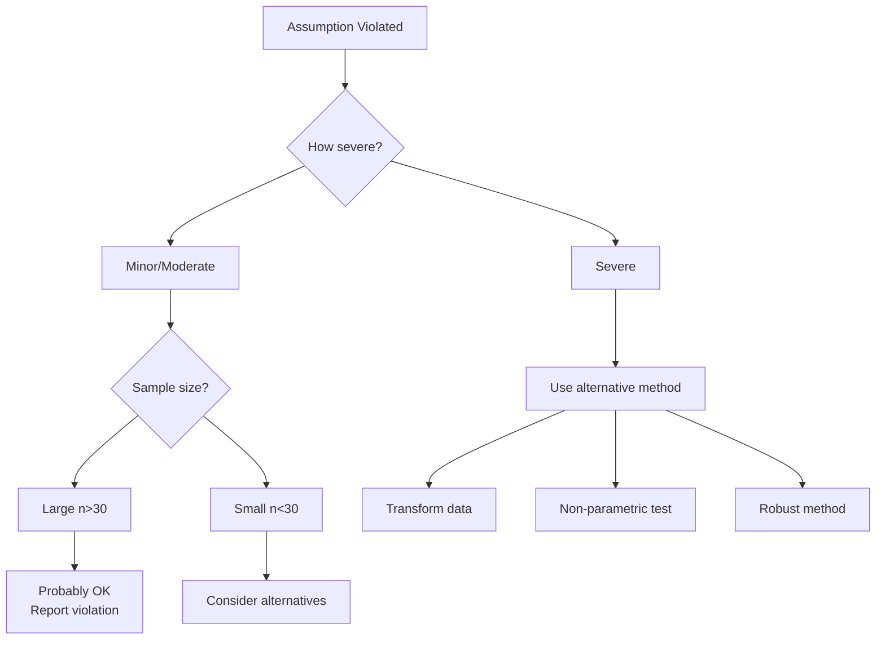

# When Assumptions Fail

What to do when your data violate statistical assumptions.

## 🎯 General Strategy



---

## 📊 Normality Violated

### Option 1: Check Sample Size

**Large samples (n > 30 per group):**
- Most tests are **robust** to normality violations
- Central Limit Theorem protects you
- Proceed with caution, report the violation

**Small samples (n < 30 per group):**
- Violations matter more
- Consider alternatives below

### Option 2: Transform Data

**Common transformations:**

```r
# Log transformation (for right skew)
data$log_var <- log(data$variable)

# Square root (for moderate right skew)
data$sqrt_var <- sqrt(data$variable)

# Reciprocal (for strong right skew)
data$recip_var <- 1 / data$variable

# After transformation, check normality again
shapiro.test(data$log_var)
```

!!! warning "Important"
    After transformation, interpret results in transformed units or back-transform for reporting.

### Option 3: Use Non-Parametric Alternative

| Parametric Test | Non-Parametric Alternative |
|-----------------|----------------------------|
| One-sample t-test | Wilcoxon Signed-Rank Test |
| Independent t-test | Mann-Whitney U Test |
| Paired t-test | Wilcoxon Signed-Rank Test |
| One-Way ANOVA | Kruskal-Wallis Test |
| Repeated Measures ANOVA | Friedman Test |
| Pearson Correlation | Spearman Correlation |

See: [Non-Parametric Tests](../non-parametric/overview.md)

---

## 📏 Unequal Variances

### For t-tests

**Easy fix:** R's default `t.test()` uses Welch's t-test (no equal variance assumption)

```r
# This handles unequal variances automatically
t.test(outcome ~ group, data = data)
```

### For ANOVA

**Use Welch's ANOVA:**

```r
oneway.test(outcome ~ group, data = data)
```

**Or transform data:**

```r
# Log transformation often equalizes variances
data$log_outcome <- log(data$outcome)
model <- aov(log_outcome ~ group, data = data)
```

---

## 📈 Non-Linearity (Regression)

### Option 1: Add Polynomial Terms

```r
# Add squared term
model <- lm(outcome ~ predictor + I(predictor^2), data = data)

# Add cubic term if needed
model <- lm(outcome ~ predictor + I(predictor^2) + I(predictor^3), data = data)
```

### Option 2: Transform Variables

```r
# Log-transform X, Y, or both
model <- lm(log(outcome) ~ log(predictor), data = data)
```

### Option 3: Use Non-Linear Models

```r
# Example: exponential relationship
nls_model <- nls(outcome ~ a * exp(b * predictor), 
                 data = data, 
                 start = list(a = 1, b = 0.1))
```

---

## 🔗 Multicollinearity (Regression)

### Solution 1: Remove Redundant Predictors

```r
# Check VIF
library(car)
vif(model)

# Remove predictor with highest VIF > 10
# Refit model without that predictor
```

### Solution 2: Combine Correlated Predictors

```r
# Average highly correlated predictors
data$combined_predictor <- (data$pred1 + data$pred2) / 2

model <- lm(outcome ~ combined_predictor + other_preds, data = data)
```

### Solution 3: Use Ridge Regression

```r
library(glmnet)

# Prepare data
x <- model.matrix(outcome ~ pred1 + pred2 + pred3, data = data)[, -1]
y <- data$outcome

# Fit ridge regression
ridge_model <- glmnet(x, y, alpha = 0)
```

---

## 🎲 Independence Violated

### Clustered Data

**Use mixed models:**

```r
library(lme4)

# Random intercept for clusters (e.g., classrooms)
mixed_model <- lmer(outcome ~ predictor + (1|cluster), data = data)
```

### Repeated Measures

**Use repeated measures ANOVA or mixed models:**

```r
# Repeated measures ANOVA
library(ez)
ezANOVA(data = data, 
        dv = outcome, 
        wid = subject_id, 
        within = time)

# Or mixed model
library(lme4)
lmer(outcome ~ time + (1|subject_id), data = data)
```

---

## 📉 Small Expected Frequencies (Chi-Square)

### Solution 1: Combine Categories

```r
# Combine rare categories
data$var_collapsed <- ifelse(data$var %in% c("Rare1", "Rare2"), 
                              "Combined", 
                              data$var)

chisq.test(table(data$var_collapsed, data$other_var))
```

### Solution 2: Fisher's Exact Test (2×2 only)

```r
# For 2×2 tables with small counts
fisher.test(table(data$var1, data$var2))
```

### Solution 3: Collect More Data

Sometimes this is the only real solution!

---

## 🎯 Decision Flowchart

```
Assumption Violated
    ↓
Is sample large (n>30)?
    ↓ Yes                    ↓ No
Probably OK              Consider alternatives
Report violation             ↓
    ↓                    Try transformation
Continue analysis            ↓
                        Still violated?
                             ↓
                    Use non-parametric test
```

---

## 📝 Reporting Violations

**Always report:**
1. Which assumption was checked
2. Method used to check (test + visual)
3. Result of check
4. What you did about it

**Example:**

> "Normality was assessed using Shapiro-Wilk test and Q-Q plots. Residuals showed significant deviation from normality (W = 0.89, p = .03), with evidence of right skewness. Due to the moderate sample size (n = 25) and severity of the violation, we conducted a Mann-Whitney U test instead of an independent t-test."

---

## 💡 General Advice

!!! tip "Best Practices"
    1. **Check assumptions BEFORE finalizing analysis**
    2. **Don't cherry-pick** - decide on method before seeing results
    3. **Be transparent** - report all assumption checks
    4. **When in doubt, use conservative alternatives**
    5. **Consider consulting a statistician** for complex violations

!!! warning "What NOT to Do"
    ❌ Ignore violated assumptions  
    ❌ Try multiple tests until one "works"  
    ❌ Transform data repeatedly until it's "normal"  
    ❌ Remove outliers without justification  
    ❌ Proceed knowing assumptions are severely violated  

---

## 📚 Resources

**Interactive learning:** [Normality Modules](../modules/overview.md#1-checking-normality-series-5-modules)

**Non-parametric alternatives:** [Non-Parametric Tests](../non-parametric/overview.md)

**Understanding assumptions:** [Understanding Normality](understanding-normality.md)

---

[← Other Assumptions](other-assumptions.md) | [Home](../index.md)
