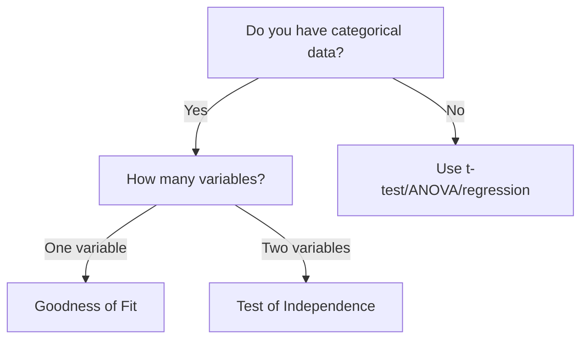

# Chi-Square Tests

!!! info "What Are Chi-Square Tests?"
    Chi-square (χ²) tests analyze **categorical data** (counts/frequencies). They test whether observed frequencies differ from expected frequencies.

## 🎯 When to Use Chi-Square

**Perfect for:**
- Categorical variables (groups, categories)
- Count data (frequencies)
- Proportions
- Cross-tabulations

**NOT for:**
- Continuous data (use t-test/ANOVA/regression instead)
- Small expected frequencies (< 5 per cell)

---

## 📊 Two Types of Chi-Square Tests

### 1. Goodness of Fit
**Question:** Does one categorical variable match expected proportions?

**Example:** Do students prefer online, hybrid, or in-person equally?

### 2. Test of Independence
**Question:** Are two categorical variables related?

**Example:** Is major choice related to gender?

---

## ✅ Chi-Square Goodness of Fit

### Purpose
Compare observed frequencies to expected frequencies for **one variable**.

### Example Scenario
You surveyed 100 students about preferred course format:
- Online: 45 students
- Hybrid: 30 students  
- In-person: 25 students

**Question:** Do students have equal preferences (33.3% each)?

### R Code

```r
# Observed frequencies
observed <- c(45, 30, 25)

# Expected frequencies (equal preference = 33.33 each)
# You can specify proportions
expected_prop <- c(1/3, 1/3, 1/3)

# Or just let R assume equal
chisq.test(observed)

# With specific expected proportions
chisq.test(observed, p = expected_prop)

# Visualization
barplot(observed, 
        names.arg = c("Online", "Hybrid", "In-Person"),
        main = "Course Format Preferences",
        col = "steelblue",
        ylab = "Number of Students")
```

### Interpreting Output

- **χ² statistic:** Measures how much observed differs from expected
- **df:** Degrees of freedom = (categories - 1)
- **p-value:** If < .05, preferences differ from expected

### Reporting

"A chi-square goodness of fit test showed that course format preferences differed significantly from equal distribution, χ²(2) = [statistic], p = [p-value]. Students preferred online (45%) over hybrid (30%) and in-person (25%) formats."

---

## 🔗 Chi-Square Test of Independence

### Purpose
Test whether **two categorical variables** are related.

### Example Scenario
Is there a relationship between major (STEM vs Humanities) and preferred format (Online vs In-Person)?

|  | Online | In-Person | Total |
|---|--------|-----------|-------|
| **STEM** | 35 | 15 | 50 |
| **Humanities** | 20 | 30 | 50 |
| **Total** | 55 | 45 | 100 |

### R Code

```r
# Create contingency table
data_table <- matrix(c(35, 20, 15, 30), 
                     nrow = 2, 
                     byrow = TRUE)

rownames(data_table) <- c("STEM", "Humanities")
colnames(data_table) <- c("Online", "In-Person")

# View table
data_table

# Run chi-square test
result <- chisq.test(data_table)
result

# See expected frequencies
result$expected

# If you have raw data instead:
# chisq.test(table(data$major, data$format))

# Visualization
barplot(data_table, 
        beside = TRUE,
        legend = TRUE,
        col = c("steelblue", "coral"),
        main = "Format Preference by Major",
        xlab = "Format",
        ylab = "Count")
```

### Interpreting Output

- **χ² statistic:** Measures strength of association
- **df:** (rows - 1) × (columns - 1)
- **p-value:** If < .05, variables are related
- **Expected frequencies:** What you'd expect if no relationship

!!! warning "Check Expected Frequencies"
    All expected frequencies should be ≥ 5. If not, results may be unreliable.

### Effect Size: Cramér's V

```r
# Calculate Cramér's V
library(lsr)
cramersV(data_table)

# Or manually:
n <- sum(data_table)
min_dim <- min(nrow(data_table) - 1, ncol(data_table) - 1)
V <- sqrt(result$statistic / (n * min_dim))
V
```

**Interpretation:**

| V value | Strength (df=1) | Strength (df=2) |
|---------|-----------------|-----------------|
| 0.10 | Small | Small |
| 0.30 | Medium | Medium |
| 0.50 | Large | Large |

### Reporting

"A chi-square test of independence showed a significant association between major and format preference, χ²(1) = [statistic], p = [p-value], V = [Cramér's V]. STEM students preferred online format (70%) while Humanities students preferred in-person (60%)."

---

## 📋 Assumptions & Requirements

!!! warning "Critical Requirements"
    **1. Expected Frequencies ≥ 5**
    - Check: `result$expected`
    - If violated: Use Fisher's Exact Test (for 2×2 tables)
    
    **2. Independent Observations**
    - Each person counted only once
    - No repeated measures
    
    **3. Categories Mutually Exclusive**
    - Each observation in exactly one category

---

## 🔧 Advanced Options

### Fisher's Exact Test
For 2×2 tables with small expected frequencies:

```r
fisher.test(data_table)
```

### Post-Hoc Tests
For larger tables (> 2×2), examine standardized residuals:

```r
result <- chisq.test(data_table)
result$stdres  # Standardized residuals

# Values > |2| suggest that cell contributes to significance
```

### Multiple Comparisons
For multiple chi-square tests, adjust p-values:

```r
# Example: comparing 3 groups
p_values <- c(0.03, 0.04, 0.01)
p.adjust(p_values, method = "bonferroni")
```

---

## 🎓 Interactive Learning

!!! tip "Practice with Real Data"
    Try our [Chi-Square Interactive Module](https://jkoxford-a11y.github.io/solid-carnival/chi-square.html)
    
    Features:
    - Visual demonstrations
    - Immediate feedback
    - Real-world scenarios
    - Expected frequency calculations

---

## 💡 Common Mistakes

❌ **Using chi-square for continuous data**  
✅ Use t-test, ANOVA, or regression instead

❌ **Expected frequencies < 5**  
✅ Use Fisher's Exact Test or combine categories

❌ **Reporting without percentages**  
✅ Always report both counts and percentages

❌ **Testing more than 2 variables**  
✅ Chi-square works with 2 variables only

❌ **Assuming causation**  
✅ Chi-square shows association, not causation

---

## 📊 Quick Decision Guide



---

## 📚 Quick Reference

| Test Type | Use When | R Function | Effect Size |
|-----------|----------|------------|-------------|
| Goodness of Fit | 1 variable vs expected | `chisq.test(observed)` | - |
| Test of Independence | 2 variables | `chisq.test(table)` | Cramér's V |
| Fisher's Exact | 2×2, small frequencies | `fisher.test(table)` | Odds ratio |

---

## 🔢 Sample Size Considerations

**Minimum Requirements:**
- Expected frequency ≥ 5 in each cell
- For 2×2 tables: At least 20-40 total observations
- For larger tables: At least 5 observations per cell expected

**If violated:**
- Combine categories (if logical)
- Use Fisher's Exact Test (2×2 only)
- Collect more data

---

[← Back to Home](../index.md) | [Decision Tree](../which-test/decision-tree.md) | [Non-Parametric Tests](../non-parametric/overview.md)
