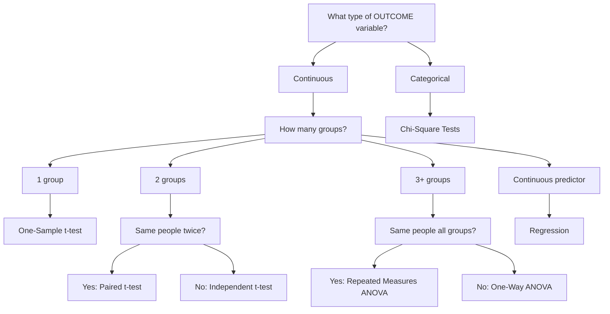

# Statistical Test Selection: Decision Tree

!!! info "Quick Reference"
    Follow the flowchart below by answering simple questions about your data. Each path leads you to the appropriate statistical test.

---

## Decision Flowchart

---

## Text-Based Decision Tree

### START: What type of OUTCOME variable do you have?

#### → CONTINUOUS (numbers with meaning)

**How many GROUPS do you want to compare?**

=== "ONE group"
    **Compare to known value?**
    
    → YES: **One-Sample t-test**
    
    Compare your sample mean to a known population value (e.g., national average)

=== "TWO groups"
    **Same people measured twice?**
    
    → YES: **Paired t-test**  
    Same participants at two time points or conditions
    
    → NO: **Independent t-test**  
    Different people in each group
    
    !!! warning "Assumptions violated?"
        Use **Mann-Whitney U test** instead

=== "THREE OR MORE groups"
    **Same people across all groups?**
    
    → YES: **Repeated Measures ANOVA**
    
    !!! warning "Assumptions violated?"
        Use **Friedman Test** instead
    
    → NO: **One-Way ANOVA**
    
    !!! warning "Assumptions violated?"
        Use **Kruskal-Wallis test** instead

=== "TWO FACTORS"
    **Two grouping variables?**
    
    → **Two-Way ANOVA**
    
    - Test interaction? Use `*`
    - Main effects only? Use `+`

=== "CONTINUOUS PREDICTOR"
    **Want to predict outcome from predictor(s)?**
    
    → ONE predictor: **Simple Linear Regression**
    
    → MULTIPLE predictors: **Multiple Regression**
    
    !!! warning "Assumptions violated?"
        Consider transformation or robust methods

#### → CATEGORICAL (groups/categories)

**How many variables?**

=== "ONE variable"
    **Chi-Square Goodness-of-Fit**
    
    Compare observed frequencies to expected frequencies

=== "TWO variables"
    **Chi-Square Test of Independence**
    
    Are two categorical variables related?

---

## Quick Reference Table

| Your Situation | Test to Use | Section | Key Assumptions |
|----------------|-------------|---------|-----------------|
| Compare 1 group to known value | One-Sample t-test | [T-Tests](../parametric/t-tests/overview.md) | Normality |
| Compare 2 independent groups | Independent t-test | [T-Tests](../parametric/t-tests/overview.md) | Normality, independence |
| Compare same people twice | Paired t-test | [T-Tests](../parametric/t-tests/overview.md) | Normality of differences |
| Compare 3+ independent groups | One-Way ANOVA | [ANOVA](../parametric/anova/overview.md) | Normality, equal variance |
| Compare groups with 2 factors | Two-Way ANOVA | [ANOVA](../parametric/anova/overview.md) | Normality, equal variance |
| Same people, 3+ times | Repeated Measures ANOVA | [ANOVA](../parametric/anova/overview.md) | Sphericity, normality |
| Predict continuous from continuous | Regression | [Regression](../parametric/regression/overview.md) | Linearity, normality of residuals |
| Relate 2 continuous variables | Pearson Correlation | [Regression](../parametric/regression/overview.md) | Linearity, bivariate normality |
| Compare frequencies/counts | Chi-Square | [Chi-Square](../chi-square/overview.md) | Expected counts ≥ 5 |
| Non-normal, 2 groups | Mann-Whitney U | [Non-Parametric](../non-parametric/overview.md) | Independence |
| Non-normal, 3+ groups | Kruskal-Wallis | [Non-Parametric](../non-parametric/overview.md) | Independence |
| Non-normal, paired data | Wilcoxon Signed-Rank | [Non-Parametric](../non-parametric/overview.md) | Symmetric differences |

---

## Step-by-Step Questions

### Question 1: What is my OUTCOME variable?

- **Continuous** (measurements, scores, times) → Go to Question 2
- **Categorical** (groups, yes/no, categories) → Chi-Square

### Question 2: What is my PREDICTOR variable?

- **Groups/Categories** → Go to Question 3
- **Continuous** (another measurement) → Regression/Correlation

### Question 3: How many groups?

- **1 group** (comparing to known value) → One-Sample t-test
- **2 groups** → Go to Question 4
- **3+ groups** → Go to Question 5

### Question 4: Are the two groups independent?

- **Same people measured twice** → Paired t-test
- **Different people in each group** → Independent t-test
- Check normality → If violated, use Mann-Whitney U

### Question 5: Are there 3+ groups?

- **Same people in all groups** → Repeated Measures ANOVA
- **Different people in each group** → One-Way ANOVA
- **Two factors** (2 grouping variables) → Two-Way ANOVA
- Check normality → If violated, use Kruskal-Wallis

---

!!! tip "Still Unsure?"
    Check out [Common Scenarios](scenarios.md) for real research examples!

---

[← Back to Home](../index.md) | [Common Scenarios →](scenarios.md)
